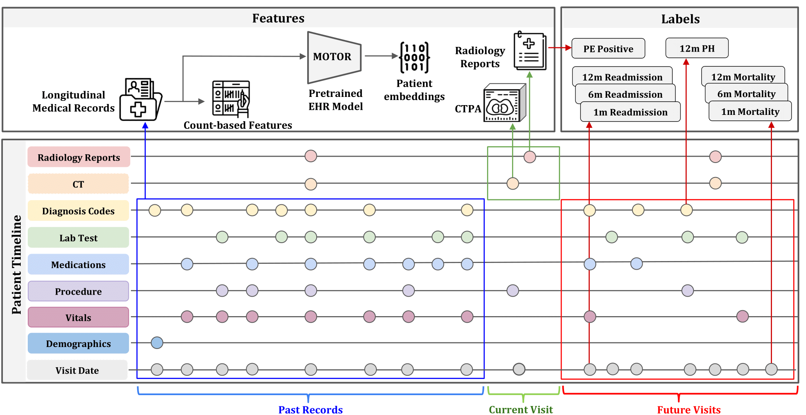

# INSPECT 🔎 🩻  Dataset + Benchmark
**Integrating Numerous Sources for Prognostic Evaluation of Clinical Timelines (INSPECT)**


This repository contains both the code to generate the INSPECT dataset as well as our benchmark.

Check out our:
* [INSPECT website](https://som-shahlab.github.io/inspect-website/)
* [Arxiv version](https://arxiv.org/abs/2311.10798)
* [Shahlab page](https://shahlab.stanford.edu/inspect)

> 🔔 **Notice (May 2025)**  
> New tutorial for labeling, model weight download, etc. can be found [here](https://github.com/som-shahlab/tte-pretraining)

### Note:

```./cohort``` and ```./reports``` contains the code that was used to generate the INSPECT dataset. These programs cannot be run with the INSPECT dataset as they require identified data, but help illustrate the exact steps we did to form our cohort.

```./ehr``` and ```./image``` contains the code for our benchmark that tries to predict our eight labels using EHR and CT image data. These folders are designed to run on the public release of the INSPECT dataset. See the respective README.md in each subfolder to see how to run each component. The ehr processing must be run first.

Once you have ran both the ehr and image analysis, you can do model fusion and reproduce our result tables by running get_model_performance.py.

# Installation of **FEMR** 💿
Our data preprocessing pipeline we use **[FEMR  (Framework for Electronic Medical Records)](https://github.com/som-shahlab/femr)**, a Python package for building deep learning models with EHR data. 

You must also have CUDA/cuDNN installed (we recommend CUDA 11.8 and cuDNN 8.7.0)

```bash
pip install --upgrade "jax[cuda11_pip]==0.4.8" -f https://storage.googleapis.com/jax-releases/jax_cuda_releases.html
pip install "femr_cuda[models]==0.0.20"
```

# ***Comparison with previous datasets*** 📊

| Dataset                            | Imaging Modalities            | Reports | EHR     | #Patients | #Image Studies | Diagnostic Tasks | Prognostic Tasks |
|------------------------------------|-------------------------------|---------|---------|-----------|----------------|------------------|------------------|
| Open-I                             | Chest X-ray                   | Yes     | -       |           | 7,466          | -                | -                |
| CheXpert                           | Chest X-ray                   | -       | -       | 65,240    | 224,316        | 14               | -                |
| MIMIC-CXR                          | Chest X-ray                   | Yes     | Yes     | 65,379    | 227,835        | 14               | -                |
| UK Biobank Imaging                 | Multiple MRI, DXA, Ultrasound | -       | Partial | 100,000   | Many           | *                | *                |
| RSNA PE                            | CT                            | -       | -       | 12,195    | 12,195         | 13               | -                |
| RadFusion                          | CT                            | -       | Partial | 1,794     | 1,837          | 1                | -                |
| INSPECT (Ours)                     | CT                            | Yes     | Yes     | 19,402    | 23,248         | 1                | 3                |


# 1. Image modality experiment 
To generate image model results: 
- Make sure to change the dicom\_dir and csv\_path in configs files from **./radfusion/configs/dataset**
- Train slice encoder using **run_rsna.sh**. Make sure the download the RSNA RESPECT dataset from [here](https://www.rsna.org/education/ai-resources-and-training/ai-image-challenge/rsna-pe-detection-challenge-2020)
- Extract slice representation using **run_featurize.sh**.
    - Remember to change the ckpt path in **image/radfusion3/configs/model/resnetv2_ct.yaml**
- After that you can using **run_classify_all.sh** to get classification results on all 8 tasks
    - If you want, run hyperparameter search with **wandb sweep sweep.yaml**. Note that line 8 specifies the prediction target. 


### To simply replicate our results (injesting our trained model weights)
> conda activate radfusion3 \
> cd image \
> ./run_classify_all.sh


# 2. EHR modality experiment
This code implements the EHR component of the INSPECT code and benchmark.

It is recommended to run Python 3.10 with this code as it has only been tested with Python 3.10

In order to use:

> cd ehr\
> pip install -r requirements.txt \
> run_all_ehr.py # with the path to the INSPECT data , a path to store output, a path to a download from Athena, and a path to a pretrained MOTOR model. 

Athena is an OHDSI service for downloading ontologies. Simply visit https://athena.ohdsi.org, create an account, and click download at the top.

MOTOR will be obtainable from https://huggingface.co/StanfordShahLab/motor-t-base

python run_all_ehr.py --path_to_data PATH_TO_DATASET --path_to_output PATH_TO_OUTPUT --path_to_athena PATH_TO_ATHENA_DOWNLOAD --path_to_motor PATH_TO_MOTOR

The output of this command can be analyzed with get_model_performance.py in the parent folder.

### &rarr; Example to run ehr code (assume you installed FEMR):
> conda activate FEMR_ENV \
> cd ehr \
> python run_all_ehr.py \
--path_to_data /share/pi/nigam/projects/zphuo/data/PE/inspect \
--path_to_output /share/pi/nigam/projects/zphuo/data/PE/inspect/output \
--path_to_motor /share/pi/nigam/projects/zphuo/models/motor_release \


#### Some notes:

1. In order to use MOTOR/GBM, you need to extract data through FEMR ETL, either [omop specific](https://github.com/som-shahlab/femr/blob/de3673d3c0389dbcbb89c5b190a9703e5ec1519a/tutorials/2a_OMOP_ETL.ipynb) or [generic one](https://github.com/som-shahlab/femr/blob/de3673d3c0389dbcbb89c5b190a9703e5ec1519a/tutorials/2b_Simple_ETL.ipynb) 


2. After that, you can use code in this repo: */ehr/run_all_ehr.py* to run your experiments. Remember to change the input to the corresponding file that

- *path_to_data*: your cohort's data csv, specifically you need to have 'PatientID', 'StudyTime'. If you have customed labels you need to append those in the columns
    - We provided Stanford side of labels as an example, you should follow this format when inputting the csv (e.g. */share/pi/nigam/projects/zphuo/data/PE/inspect/cohort_0.2.0_master_file_anon.csv*)
- *path_to_output*: path to save the labels/features, the MOTOR batches, and the GBM/MOTOR results
- *path_to_motor*: path to MOTOR model artifact
- *test_GBM*: if you want to test our trained GBM artifact. You should put the folder from medicine box *./gbm_model_results* under the *./output* folder in argument *path_to_output*, e.g. */share/pi/nigam/projects/zphuo/data/PE/inspect/output/gbm_model_results*

3. Note the MOTOR now is a frozn backbone so we always need to append a linear head at the end when doing inference. That means you will need to have 'train/valid/test' split in your csv (see our example in *cohort_0.2.0_master_file_anon.csv*) in *path_to_data* to train a linear head (logistic regression) and then do inference

4. After you run the script, you will see something like
> [INFO] Got dummy batch ...

Or 

> [INFO] Transformed the model function.

Those are innate logging from FEMR for debugging. You only need to search for key words in your terminal to see performance (or you can go to each folder */motor_results/{task}/log* to see the results)

> Test AUROC: 0.8*****


# 3. Aggregate results
To get performance results, simply run

> export path_to_data="PATH/TO/COHORT/CSV" \
> export path_to_output="PATH/TO/OUTPUT/FOLDERS/FROM/ABOVE/MODALITES" \
> python get_model_performance.py \
>    --path_to_data \${path_to_data} \
>    --path_to_output ${path_to_output} \
>    --metric auroc \
>    --multiple_seeds "0 1 2 3 4" 


